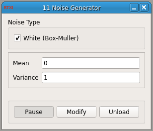

### Noise Generator

**Requirements:** GSL library (included)  
**Limitations:** None  

<!--start-->

**Noise Generator**: Generates noise of the type specified.

<!--end-->

#### Input

#### Output
1. output(0) - Noise Waveform : Noise Waveform

#### Parameters
1. Mean - Mean
2. Variance - Variance

