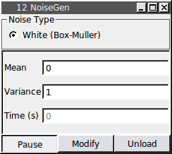

###Noise Generator

**Requirements:** Generator class (included), GSL library  
**Limitations:** none noted   

This module continuously generates Gaussian white noise computed using the Box-Muller method. This module is already included in RTXI v1.3+. You may edit this source code (eg. adding additional noise types). Compiling and installing this module will then overwrite the bundled version of the noise generator..

####Output Channels
1. output(0) – “Noise Waveform”

####Parameters
1. Mean
2. Variance
